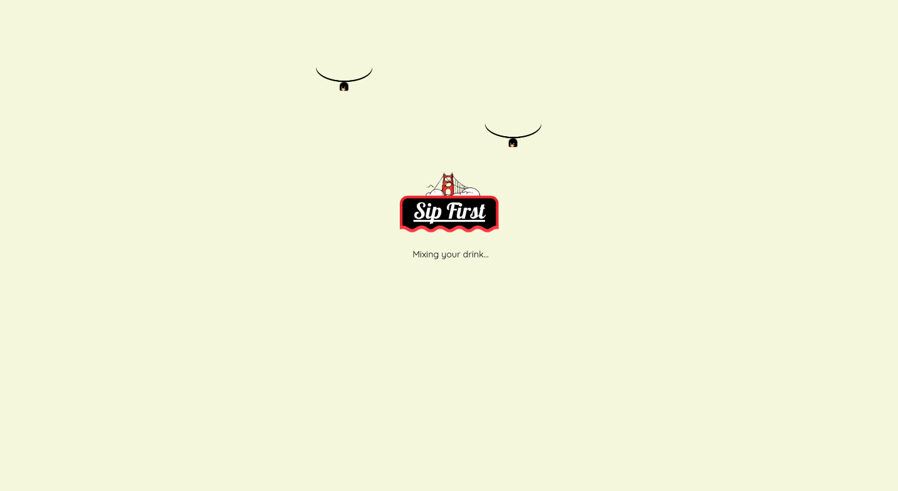
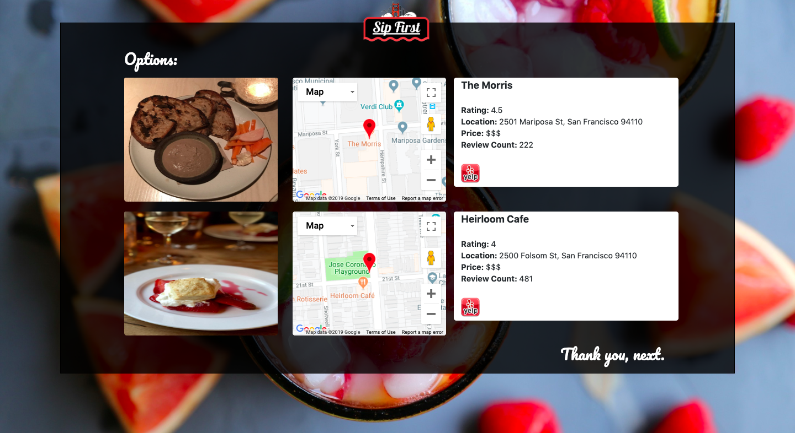

# SIP :coffee: :tropical_drink:

## Description of Site
"Sip First" is an app for an individual that lives in SF and is looking to grab a drink. The premise of this site was to address paralysis by analysis which occurs when users are overwhelmed with too many choices and often do not feel satisfaction even after making a choice due to wondering, 'what if'. We address this issue by highlighting binary user choice in our design and providing the user with a smaller scope allowing for quicker, more concise decisions. 

### Logic
The basic logic flow of this web-based application begins with the user-input. The user inputs their parameters for their search, thus dynamically generating their final search query. That search query, once its parameters are completed, is used to perform an Ajax call to the Yelp API to return a JSON object with data to leveraged for rendering on the page. But before all of our information is rendered onto the page, we take location data from the Ajax call and send a request to the Google Maps API to dynamically generate a Javascript map w/ markers according to the location of the businesses received from the Yelp API.

tl;dr... [ WEB-CLIENT(input) ==> YELP API ==> GOOGLE API ==> WEB-CLIENT(render) ]

## Pictures of Site
[Click here to visit site](https://minori-fh.github.io/Sip/)

Initial loading page: 

Page for the user to make two choices:
1.) Do they want to drink alcohol or coffee?
2.) What's most important to them: price or location? 

Page for the user to go through 3 sets of two options

Page for the user to see where their options are located

## Improvements for the Future
1. Mobile responsiveness
2. Incorporate user authentication to allow users to favorite bars/ cafes on their account to visit later
3. Ability to update the comments that users have already left on a doge
4. Refactor html code to separate files for easier maintenance 

## Getting Started
No external packages or installments are necessary to get a copy of the project up and running on your local machine for development or testing purposes. 

## Technologies Used
1. [HTML](https://developer.mozilla.org/en-US/docs/Web/Guide/HTML/HTML5)
2. [CSS3](https://developer.mozilla.org/en-US/docs/Web/CSS)
3. [Bootstrap](https://getbootstrap.com/)
4. [Javascript](https://developer.mozilla.org/en-US/docs/Web/JavaScript)
5. [jQuery](https://api.jquery.com/)
6. [Google Maps](https://developers.google.com/maps/documentation/) and [Yelp API](https://www.yelp.com/developers/documentation/v3)
8. [Firebase](https://firebase.google.com/docs)

## Author(s): 
1. [Minori Hashimoto](https://github.com/minori-fh)
2. Derek Goldstone
3. Christopher Celestino
4. Joanne Badua
