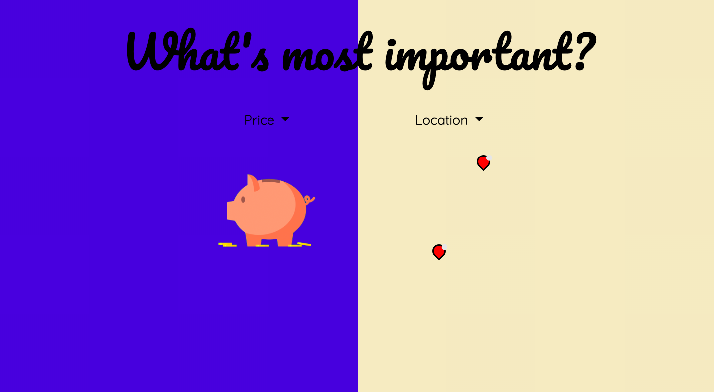

# Project-01

## Pictures of Site
Initial loading page: 

Page for the user to pick alcohol or coffee

Page for the user to pick location or price as their priority

Page for the user to go through 3 sets of two options

Page for the user to see where their options are located

## Description of Site
"Sip First" is an app for an individual that lives in SF and is looking to grab a drink. The premise of this site was to address paralysis by analysis which occurs when users are overwhelmed with too many choices and often do not feel satisfaction even after making a choice due to wondering, 'what if'.

## Technologies Used
1. HTML 
2. CSS
3. Bootstrap
4. Javascript
5. jQuery
6. AJAX calls for Google Maps and Yelp API
7. Codepen and animista libraries
8. Firebase

## Author(s): 
1. [Minori Hashimoto](https://github.com/minori-fh)
2. Derek Goldstone
3. Christopher Celestino
4. Joanne Badua
